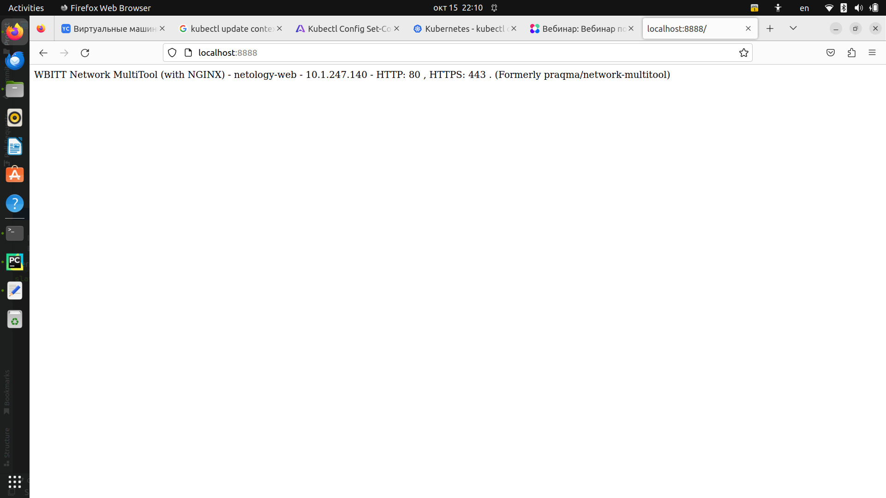

# Домашнее задание к занятию «Базовые объекты K8S»

### Цель задания

В тестовой среде для работы с Kubernetes, установленной в предыдущем ДЗ, необходимо развернуть Pod с приложением и подключиться к нему со своего локального компьютера. 

------

### Чеклист готовности к домашнему заданию

1. Установленное k8s-решение (например, MicroK8S).
2. Установленный локальный kubectl.
3. Редактор YAML-файлов с подключенным Git-репозиторием.

------

### Инструменты и дополнительные материалы, которые пригодятся для выполнения задания

1. Описание [Pod](https://kubernetes.io/docs/concepts/workloads/pods/) и примеры манифестов.
2. Описание [Service](https://kubernetes.io/docs/concepts/services-networking/service/).

------

### Задание 1. Создать Pod с именем hello-world

1. Создать манифест (yaml-конфигурацию) Pod.
2. Использовать image - gcr.io/kubernetes-e2e-test-images/echoserver:2.2.
3. Подключиться локально к Pod с помощью `kubectl port-forward` и вывести значение (curl или в браузере).

### Решение 1.
1 & 2 Done
```commandline
slava@slava-FLAPTOP-r:~$ kubectl apply -f ./Documents/k8s_edu/pod_1.yaml 
pod/hello-world created
slava@slava-FLAPTOP-r:~$ cat ./Documents/k8s_edu/pod_1.yaml 
apiVersion: v1
kind: Pod
metadata:
  name: hello-world
  labels:
    app: hello-world
spec:
  containers:
  - name: hello-world
    image: gcr.io/kubernetes-e2e-test-images/echoserver:2.2
    ports:
    - containerPort: 81
      name: web
      protocol: TCP
slava@slava-FLAPTOP-r:~$ kubectl get pods
NAME           READY   STATUS    RESTARTS   AGE
netology-web   1/1     Running   0          11m
hello-world    1/1     Running   0          59s
```
3. Вот тут начались проблемы, так как прокидывание портов проходит успешно, но при попытке подключиться появляется ошибка подключения к pod
```commandline
slava@slava-FLAPTOP-r:~$ kubectl port-forward pod/hello-world 8181:81
Forwarding from 127.0.0.1:8181 -> 81
Forwarding from [::1]:8181 -> 81
Handling connection for 8181
E1015 22:16:03.001525  667157 portforward.go:409] an error occurred forwarding 8181 -> 81: error forwarding port 81 to pod 8510336166a8f3efd50bc71d72de7f89732268e101ae0ece6a1db827285e768b, uid : failed to execute portforward in network namespace "/var/run/netns/cni-7facd671-c22f-9d83-c83d-3013ebdb8643": failed to connect to localhost:81 inside namespace "8510336166a8f3efd50bc71d72de7f89732268e101ae0ece6a1db827285e768b", IPv4: dial tcp4 127.0.0.1:81: connect: connection refused IPv6 dial tcp6 [::1]:81: connect: connection refused 
error: lost connection to pod
```

    Хотя все тоже самое работало для задания и решения 2. Убил кучу времени, и так и сяк переписывал настройки пода, но так и не понял из-за чего не работает :(

------

### Задание 2. Создать Service и подключить его к Pod

1. Создать Pod с именем netology-web.
2. Использовать image — gcr.io/kubernetes-e2e-test-images/echoserver:2.2.
3. Создать Service с именем netology-svc и подключить к netology-web.
4. Подключиться локально к Service с помощью `kubectl port-forward` и вывести значение (curl или в браузере).

### Решение 2.
1 & 2. Done
```commandline
slava@slava-FLAPTOP-r:~$ kubectl apply -f Documents/k8s_edu/pod_1.yaml
pod/netology-web created
slava@slava-FLAPTOP-r:~$ kubectl get podrror from server (NotFound): services
NAME           READY   STATUS    RESTARTS   AGE
netology-web   1/1     Running   0          13s
slava@slava-FLAPTOP-r:~$ cat Documents/k8s_edu/pod_1.yaml
apiVersion: v1
kind: Pod
metadata:
  name: netology-web
spec:
  containers:
  - name: netology-web
    image: gcr.io/kubernetes-e2e-test-images/echoserver:2.2
    ports:
    - containerPort: 80
```

3. Done
```commandline
slava@slava-FLAPTOP-r:~$ cat Documents/k8s_edu/service_1.yaml
apiVersion: v1
kind: Service
metadata:
  name: netology-svc
spec:
  selector:
    app.kubernetes.io/name: netology-web
  ports:
    - protocol: TCP
      port: 80
      targetPort: 9376
slava@slava-FLAPTOP-r:~$ kubectl apply -f Documents/k8s_edu/service_1.yaml
service/netology-svc created
slava@slava-FLAPTOP-r:~$ kubectl get service
NAME           TYPE        CLUSTER-IP      EXTERNAL-IP   PORT(S)   AGE
kubernetes     ClusterIP   10.152.183.1    <none>        443/TCP   53m
netology-svc   ClusterIP   10.152.183.30   <none>        80/TCP    24s
```
4. Вот тут начались проблемы, так как прокидывание портов проходит успешно, но при попытке подключиться появляется ошибка подключения к pod
```commandline
slava@slava-FLAPTOP-r:~$ sudo kubectl port-forward svc/netology-svc 8888:80
Forwarding from 127.0.0.1:8888 -> 80
Forwarding from [::1]:8888 -> 80
Handling connection for 8888
E1015 16:32:30.024691  157432 portforward.go:409] an error occurred forwarding 8888 -> 80: error forwarding port 80 to pod 456feafc6aac20deae09a9a40bae0e2bc6a0b904ef3d8d73b852be5417d8e798, uid : failed to execute portforward in network namespace "/var/run/netns/cni-b27098a4-a85b-1df0-3602-b65af9ca5f7f": failed to connect to localhost:80 inside namespace "456feafc6aac20deae09a9a40bae0e2bc6a0b904ef3d8d73b852be5417d8e798", IPv4: dial tcp4 127.0.0.1:80: connect: connection refused IPv6 dial tcp6 [::1]:80: connect: connection refused 
error: lost connection to pod

```

    Но если всего лишь в настройках заменить image для контейнера, например как в лекции на wbitt/network-multitool, то все работает успешно.
```commandline
slava@slava-FLAPTOP-r:~$ cat ./Documents/k8s_edu/pod_1.yaml 
apiVersion: v1
kind: Pod
metadata:
  name: netology-web
  labels:
    app: netology-web
spec:
  containers:
  - name: netology-web
    image: wbitt/network-multitool
    ports:
    - containerPort: 80
      name: web
      protocol: TCP
slava@slava-FLAPTOP-r:~$ kubectl apply -f ./Documents/k8s_edu/pod_1.yaml 
pod/netology-web created
slava@slava-FLAPTOP-r:~$ kubectl port-forward svc/netology-svc 8888:80
Forwarding from 127.0.0.1:8888 -> 80
Forwarding from [::1]:8888 -> 80
Handling connection for 8888

slava@slava-FLAPTOP-r:~$ curl 127.0.0.1:8888
WBITT Network MultiTool (with NGINX) - netology-web - 10.1.247.140 - HTTP: 80 , HTTPS: 443 . (Formerly praqma/network-multitool)
```

------
