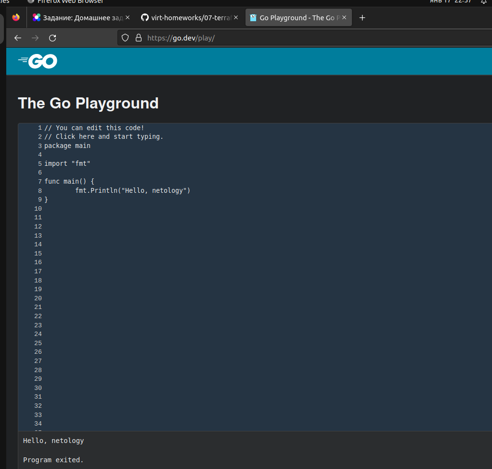
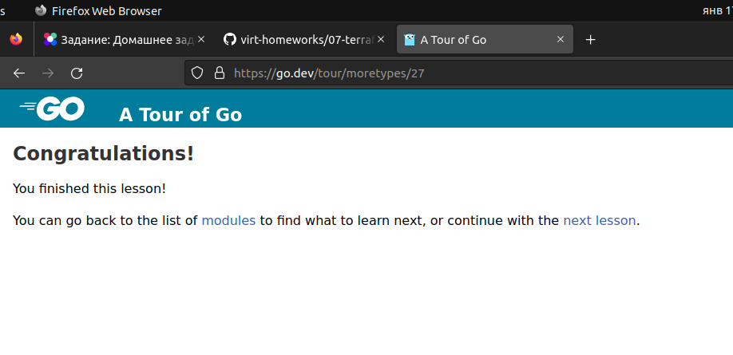

### Домашнее задание 7-5

# Задание 1
    Установите golang.

    Воспользуйтесь инструкций с официального сайта: https://golang.org/.
    Так же для тестирования кода можно использовать песочницу: https://play.golang.org/.

# Решение 1
    Установил Golang.

    
    Ну и потестировал код, попроходил обучение на play.golang.org


# Задание 2
    Знакомство с gotour.
    
    У Golang есть обучающая интерактивная консоль https://tour.golang.org/. Рекомендуется изучить максимальное количество примеров. В консоли уже написан необходимый код, осталось только с ним ознакомиться и поэкспериментировать как написано в инструкции в левой части экрана.

# Решение 2
    Пока дошел до этого урока. Дальше обязательно продолжу.


# Задание 3
    Написание кода. 
    Цель этого задания закрепить знания о базовом синтаксисе языка. Можно использовать редактор кода 
    на своем компьютере, либо использовать песочницу: [https://play.golang.org/](https://play.golang.org/).
    
    1. Напишите программу для перевода метров в футы (1 фут = 0.3048 метр). Можно запросить исходные данные 
    у пользователя, а можно статически задать в коде.
        Для взаимодействия с пользователем можно использовать функцию `Scanf`:
```
        package main
        
        import "fmt"
        
        func main() {
            fmt.Print("Enter a number: ")
            var input float64
            fmt.Scanf("%f", &input)
        
            output := input * 2
        
            fmt.Println(output)    
        }
```
     
       2. Напишите программу, которая найдет наименьший элемент в любом заданном списке, например:
```
           x := []int{48,96,86,68,57,82,63,70,37,34,83,27,19,97,9,17,}
```
       3. Напишите программу, которая выводит числа от 1 до 100, которые делятся на 3. То есть `(3, 6, 9, …)`.
    
    В виде решения ссылку на код или сам код. 

# Решение 3
    1. Напишите программу для перевода метров в футы (1 фут = 0.3048 метр)
[case 1](go_project_1/main.go)

    2. Напишите программу, которая найдет наименьший элемент в любом заданном списке
[case 2](go_project_2/main.go)

    3. Напишите программу, которая выводит числа от 1 до 100, которые делятся на 3. То есть `(3, 6, 9, …)`.
[case 3](go_project_3/main.go)

# Задание 4
    Протестировать код (не обязательно).
    
    Создайте тесты для функций из предыдущего задания.

# Решение 4
    1. Напишите программу для перевода метров в футы (1 фут = 0.3048 метр)
[test case 1](go_project_1%2Fmain_test.go)

    2. Напишите программу, которая найдет наименьший элемент в любом заданном списке
[test case 2](go_project_2%2Fmain_test.go)

    3. Напишите программу, которая выводит числа от 1 до 100, которые делятся на 3. То есть `(3, 6, 9, …)`.
[test case 3](go_project_3%2Fmain_test.go)