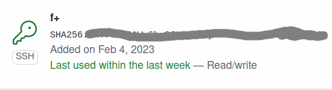

# Домашнее задание к занятию "4. Работа с roles"

## Подготовка к выполнению

### Задание 1
Познакомьтесь с [LightHouse](https://youtu.be/ymlrNlaHzIY?t=929).

### Решение 1
     Сделано

### Задание 2
    Создайте два пустых публичных репозитория в любом своём проекте: vector-role и lighthouse-role.

### Решение 2
    Сделано: 
[Vector](git@github.com:EfanRu/vector-role.git)

[Lighthouse](git@github.com:EfanRu/lighthouse-role.git)

### Задание 3
    Добавьте публичную часть своего ключа к своему профилю на GitHub.

### Решение 3
    Сделано


## Основная часть

    Ваша цель — разбить ваш playbook на отдельные roles.
    Задача — сделать roles для ClickHouse, Vector и LightHouse и написать playbook для использования этих ролей.
    Ожидаемый результат — существуют три ваших репозитория: два с roles и один с playbook.

**Что нужно сделать**

### Задание 1 
   Создайте в старой версии playbook файл `requirements.yml` и заполните его содержимым:

   ```yaml
   ---
     - src: git@github.com:AlexeySetevoi/ansible-clickhouse.git
       scm: git
       version: "1.11.0"
       name: clickhouse 
   ```

### Решение 1
    Сделано 
[requirements.yml](playbook%2Frequirements.yml)

### Задание 2
    При помощи `ansible-galaxy` скачайте себе эту роль.

### Решение 2
    Если скопировать как в задание, то получим ошибку:
```commandline
ansible-galaxy install -r ./playbook/requirements.yml 
Starting galaxy role install process
[WARNING]: - ./playbook/requirements.yml was NOT installed successfully: the downloaded file does not appear to be a valid tar archive.
ERROR! - you can use --ignore-errors to skip failed roles and finish processing the list.
```

    Но немного пострадав, находим в документации, что нужно указывать ветку. Поменяв на version: master, получаем:
```commandline
$ansible-galaxy install -r ./playbook/requirements.yml
Starting galaxy collection install process
Process install dependency map
```

### Задание 3
    Создайте новый каталог с ролью при помощи `ansible-galaxy role init vector-role`.

### Решение 3
    Для Vector:
```commandline
$ansible-galaxy role init vector-role
- Role vector-role was created successfully
```
    Для lighthouse
```commandline
$ansible-galaxy role init lighthouse-role
- Role lighthouse-role was created successfully
```

### Задание 4
    На основе tasks из старого playbook заполните новую role. Разнесите переменные между `vars` и `default`. 

### Решение 4
[vector-role](vector-role)

[lighthouse-role](lighthouse-role)

### Задание 5
    Перенести нужные шаблоны конфигов в `templates`.

### Решение 5
[templates vector](vector-role%2Ftemplates)

[templates lighthouse](lighthouse-role%2Ftemplates)

### Задание 6
    Опишите в `README.md` обе роли и их параметры.

### Решение 6
[README.md Vector](vector-role%2FREADME.md)

[README.md Lighthouse](lighthouse-role%2FREADME.md)

### Задание 7
    Повторите шаги 3–6 для LightHouse. Помните, что одна роль должна настраивать один продукт.

### Решение 7
    Сделано см. 3-6 решения.

### Задание 8
    Выложите все roles в репозитории. Проставьте теги, используя семантическую нумерацию. Добавьте roles в `requirements.yml` в playbook.

### Решение 8
[Vector git repo](https://github.com/EfanRu/vector-role)

[Lighthouse git repo](https://github.com/EfanRu/lighthouse-role)

[requirements.yml](playbook%2Frequirements.yml)

### Задание 9
    Переработайте playbook на использование roles. Не забудьте про зависимости LightHouse и возможности совмещения `roles` с `tasks`.

### Решение 9
[main.yml](playbook%2Fmain.yml)

### Задание 10
    Выложите playbook в репозиторий.

### Решение 10


### Задание 11
    В ответе дайте ссылки на оба репозитория с roles и одну ссылку на репозиторий с playbook.

### Решение 11

---