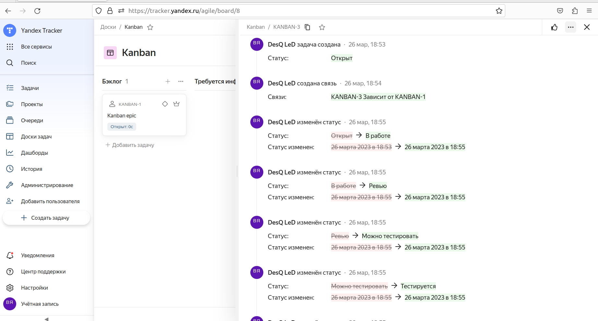

# Домашнее задание к занятию 7 «Жизненный ци
кл ПО»

## Подготовка к выполнению

### Задание 1
   Получить бесплатную версию [Jira](https://www.atlassian.com/ru/software/jira/free).

### Решение 1

   Так как jira недоступна в России, то не будем её использовать, а поищем аналог.
   Возьмем вместо неё Yandex Tracker.

### Задание 2
   Настроить её для своей команды разработки.

### Решение 2
   Сделано.

### Задание 3
   Создать доски Kanban и Scrum.

### Решение 3

## Основная часть
   Так как в Yandex Tracker нет некоторых статусов, то пришлось их добавить

### Задание 1
    Создайте задачу с типом bug, попытайтесь провести его по всему workflow до Done.

### Решение 1

### Задание 2
    Создайте задачу с типом epic, к ней привяжите несколько задач с типом task, проведите их по всему workflow до Done. 

### Решение 2

### Задание 3
    При проведении обеих задач по статусам используйте kanban.

### Решение 3
   Своевременно.

### Задание 4
    Верните задачи в статус Open

### Решение 4

### Задание 5
   Перейдите в Scrum, запланируйте новый спринт, состоящий из задач эпика и одного бага, стартуйте спринт, проведите задачи до состояния Closed. Закройте спринт.
    
### Решение 5
   Баг закрыл, но спринт закрыть раньше времени нельзя, он сам закроется.

### Задание 6
    Если всё отработалось в рамках ожидания — выгрузите схемы workflow для импорта в XML. Файлы с workflow приложите к решению задания.

### Решение 6
   Видимо в Yandex Tracker нет такой возможности, при выгрузке из очередей (workflow) он выгружает списки задач по ним.
   Вот примеры файлов.
[BUG_26-03.xml](data/BUG_26-03.xml)
[KANBAN_26-03.xml](data/KANBAN_26-03.xml)
[TASK_26-03.xml](data/TASK_26-03.xml)
---