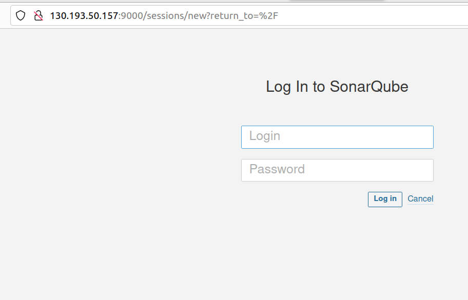
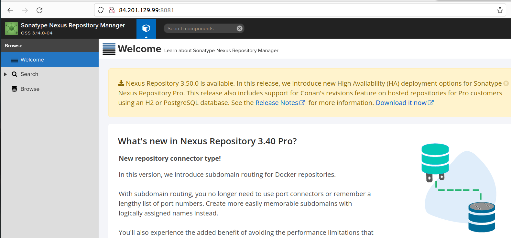

# Домашнее задание к занятию 9 «Процессы CI/CD»

## Подготовка к выполнению

### Задание 1
   Создайте два VM в Yandex Cloud с параметрами: 2CPU 4RAM Centos7 (остальное по минимальным требованиям).

### Решение 1
[hosts.yml](inventory%2Fcicd%2Fhosts.yml)

### Задание 2
   Пропишите в inventory playbook созданные хосты.

### Решение 2
[hosts.yml](inventory%2Fcicd%2Fhosts.yml)

### Задание 3
   Добавьте в files файл со своим публичным ключом (id_rsa.pub). Если ключ называется иначе — найдите таску в плейбуке, которая использует id_rsa.pub имя, и исправьте на своё.

### Решение 3
```yaml
    - name: "Set up ssh key to access for managed node"
      authorized_key:
        user: "{{ sonarqube_db_user }}"
        state: present
        key: "{{ lookup('file', 'yac2.pub') }}"
```

### Задание 4
   Запустите playbook, ожидайте успешного завершения.

### Решение 4

<details><summary>Вывод в консоль:</summary>

```commandline
ansible-playbook -i ./inventory/cicd/hosts.yml ./site.yml 

PLAY [Get OpenJDK installed] ****************************************************************************************************************************************************

TASK [Gathering Facts] **********************************************************************************************************************************************************
The authenticity of host '130.193.50.157 (130.193.50.157)' can't be established.
ED25519 key fingerprint is SHA256:xxx.
This key is not known by any other names
Are you sure you want to continue connecting (yes/no/[fingerprint])? yes
ok: [sonar-01]

TASK [install unzip] ************************************************************************************************************************************************************
changed: [sonar-01]

TASK [Upload .tar.gz file conaining binaries from remote storage] ***************************************************************************************************************
changed: [sonar-01]

TASK [Ensure installation dir exists] *******************************************************************************************************************************************
changed: [sonar-01]

TASK [Extract java in the installation directory] *******************************************************************************************************************************
changed: [sonar-01]

TASK [Export environment variables] *********************************************************************************************************************************************
changed: [sonar-01]

PLAY [Get PostgreSQL installed] *************************************************************************************************************************************************

TASK [Gathering Facts] **********************************************************************************************************************************************************
ok: [sonar-01]

TASK [Change repo file] *********************************************************************************************************************************************************
changed: [sonar-01]

TASK [Install PostgreSQL repos] *************************************************************************************************************************************************
changed: [sonar-01]

TASK [Install PostgreSQL] *******************************************************************************************************************************************************
changed: [sonar-01]

TASK [Init template1 DB] ********************************************************************************************************************************************************
changed: [sonar-01]

TASK [Start pgsql service] ******************************************************************************************************************************************************
changed: [sonar-01]

TASK [Create user in system] ****************************************************************************************************************************************************
changed: [sonar-01]

TASK [Create user for Sonar in PostgreSQL] **************************************************************************************************************************************
changed: [sonar-01]

TASK [Change password for Sonar user in PostgreSQL] *****************************************************************************************************************************
changed: [sonar-01]

TASK [Create Sonar DB] **********************************************************************************************************************************************************
changed: [sonar-01]

TASK [Copy pg_hba.conf] *********************************************************************************************************************************************************
changed: [sonar-01]

PLAY [Prepare Sonar host] *******************************************************************************************************************************************************

TASK [Gathering Facts] **********************************************************************************************************************************************************
ok: [sonar-01]

TASK [Create group in system] ***************************************************************************************************************************************************
ok: [sonar-01]

TASK [Create user in system] ****************************************************************************************************************************************************
ok: [sonar-01]

TASK [Set up ssh key to access for managed node] ********************************************************************************************************************************
changed: [sonar-01]

TASK [Allow group to have passwordless sudo] ************************************************************************************************************************************
changed: [sonar-01]

TASK [Increase Virtual Memory] **************************************************************************************************************************************************
changed: [sonar-01]

TASK [Reboot VM] ****************************************************************************************************************************************************************
changed: [sonar-01]

PLAY [Get Sonarqube installed] **************************************************************************************************************************************************

TASK [Gathering Facts] **********************************************************************************************************************************************************
ok: [sonar-01]

TASK [Get distrib ZIP] **********************************************************************************************************************************************************
changed: [sonar-01]

TASK [Unzip Sonar] **************************************************************************************************************************************************************
changed: [sonar-01]

TASK [Move Sonar into place.] ***************************************************************************************************************************************************
changed: [sonar-01]

TASK [Configure SonarQube JDBC settings for PostgreSQL.] ************************************************************************************************************************
changed: [sonar-01] => (item={'regexp': '^sonar.jdbc.username', 'line': 'sonar.jdbc.username=sonar'})
changed: [sonar-01] => (item={'regexp': '^sonar.jdbc.password', 'line': 'sonar.jdbc.password=sonar'})
changed: [sonar-01] => (item={'regexp': '^sonar.jdbc.url', 'line': 'sonar.jdbc.url=jdbc:postgresql://localhost:5432/sonar?useUnicode=true&characterEncoding=utf8&rewriteBatchedStatements=true&useConfigs=maxPerformance'})
changed: [sonar-01] => (item={'regexp': '^sonar.web.context', 'line': 'sonar.web.context='})

TASK [Generate wrapper.conf] ****************************************************************************************************************************************************
changed: [sonar-01]

TASK [Symlink sonar bin.] *******************************************************************************************************************************************************
changed: [sonar-01]

TASK [Copy SonarQube systemd unit file into place (for systemd systems).] *******************************************************************************************************
changed: [sonar-01]

TASK [Ensure Sonar is running and set to start on boot.] ************************************************************************************************************************
changed: [sonar-01]

TASK [Allow Sonar time to build on first start.] ********************************************************************************************************************************
Pausing for 180 seconds
(ctrl+C then 'C' = continue early, ctrl+C then 'A' = abort)
ok: [sonar-01]

TASK [Make sure Sonar is responding on the configured port.] ********************************************************************************************************************
ok: [sonar-01]

PLAY [Get Nexus installed] ******************************************************************************************************************************************************

TASK [Gathering Facts] **********************************************************************************************************************************************************
The authenticity of host '84.201.129.99 (84.201.129.99)' can't be established.
ED25519 key fingerprint is SHA256:/xxxx.
This key is not known by any other names
Are you sure you want to continue connecting (yes/no/[fingerprint])? yes
ok: [nexus-01]

TASK [Create Nexus group] *******************************************************************************************************************************************************
changed: [nexus-01]

TASK [Create Nexus user] ********************************************************************************************************************************************************
changed: [nexus-01]

TASK [Install JDK] **************************************************************************************************************************************************************
changed: [nexus-01]

TASK [Create Nexus directories] *************************************************************************************************************************************************
changed: [nexus-01] => (item=/home/nexus/log)
changed: [nexus-01] => (item=/home/nexus/sonatype-work/nexus3)
changed: [nexus-01] => (item=/home/nexus/sonatype-work/nexus3/etc)
changed: [nexus-01] => (item=/home/nexus/pkg)
changed: [nexus-01] => (item=/home/nexus/tmp)

TASK [Download Nexus] ***********************************************************************************************************************************************************
changed: [nexus-01]

TASK [Unpack Nexus] *************************************************************************************************************************************************************
changed: [nexus-01]

TASK [Link to Nexus Directory] **************************************************************************************************************************************************
changed: [nexus-01]

TASK [Add NEXUS_HOME for Nexus user] ********************************************************************************************************************************************
changed: [nexus-01]

TASK [Add run_as_user to Nexus.rc] **********************************************************************************************************************************************
changed: [nexus-01]

TASK [Raise nofile limit for Nexus user] ****************************************************************************************************************************************
changed: [nexus-01]

TASK [Create Nexus service for SystemD] *****************************************************************************************************************************************
changed: [nexus-01]

TASK [Ensure Nexus service is enabled for SystemD] ******************************************************************************************************************************
changed: [nexus-01]

TASK [Create Nexus vmoptions] ***************************************************************************************************************************************************
changed: [nexus-01]

TASK [Create Nexus properties] **************************************************************************************************************************************************
changed: [nexus-01]

TASK [Lower Nexus disk space threshold] *****************************************************************************************************************************************
skipping: [nexus-01]

TASK [Start Nexus service if enabled] *******************************************************************************************************************************************
changed: [nexus-01]

TASK [Ensure Nexus service is restarted] ****************************************************************************************************************************************
skipping: [nexus-01]

TASK [Wait for Nexus port if started] *******************************************************************************************************************************************
ok: [nexus-01]

PLAY RECAP **********************************************************************************************************************************************************************
nexus-01                   : ok=17   changed=15   unreachable=0    failed=0    skipped=2    rescued=0    ignored=0   
sonar-01                   : ok=35   changed=27   unreachable=0    failed=0    skipped=0    rescued=0    ignored=0   

```

</details>

### Задание 5
   Проверьте готовность SonarQube через браузер.

### Решение 5

<details><summary>Скрин в браузере:</summary>



</details>


### Задание 6
   Зайдите под admin\admin, поменяйте пароль на свой.

### Решение 6
    Done.

### Задание 7
   Проверьте готовность Nexus через бразуер.

### Решение 7

<details><summary>Скрин в браузере:</summary>



</details>


### Задание 8
   Подключитесь под admin\admin123, поменяйте пароль, сохраните анонимный доступ.

### Решение 8
    Done.

## Знакомоство с SonarQube

## Основная часть

### Задание 1
    Создайте новый проект, название произвольное.

### Решение 1
    Done.

### Задание 2
    Скачайте пакет sonar-scanner, который вам предлагает скачать SonarQube.

### Решение 2
    Done.

### Задание 3
    Сделайте так, чтобы binary был доступен через вызов в shell (или поменяйте переменную PATH, или любой другой, удобный вам способ).

### Решение 3
```commandline
export PATH="$PATH:/home/slava/Downloads/sonar-scanner-cli-4.8.0.2856-linux/sonar-scanner-4.8.0.2856-linux/bin"
```

### Задание 4
    Проверьте `sonar-scanner --version`.

### Решение 4
```commandline
sonar-scanner -v
INFO: Scanner configuration file: /home/slava/Downloads/sonar-scanner-cli-4.8.0.2856-linux/sonar-scanner-4.8.0.2856-linux/conf/sonar-scanner.properties
INFO: Project root configuration file: NONE
INFO: SonarScanner 4.8.0.2856
INFO: Java 11.0.17 Eclipse Adoptium (64-bit)
INFO: Linux 5.19.0-35-generic amd64
```

### Задание 5
    Запустите анализатор против кода из директории [example](./example) с дополнительным ключом `-Dsonar.coverage.exclusions=fail.py`.

### Решение 5
    Через ошибки узнаем, что нужно было добавить в настройки файла properties IP адрес, ключ проекта и сформированный токен, что логично.

<details><summary>Вывод в консоль:</summary>

```commandline
sonar-scanner -Dsonar.coverage.exclusions=fail.py
INFO: Scanner configuration file: /home/slava/Downloads/sonar-scanner-cli-4.8.0.2856-linux/sonar-scanner-4.8.0.2856-linux/conf/sonar-scanner.properties
INFO: Project root configuration file: NONE
INFO: SonarScanner 4.8.0.2856
INFO: Java 11.0.17 Eclipse Adoptium (64-bit)
INFO: Linux 5.19.0-35-generic amd64
INFO: User cache: /home/slava/.sonar/cache
INFO: Analyzing on SonarQube server 9.1.0
INFO: Default locale: "en_US", source code encoding: "UTF-8" (analysis is platform dependent)
INFO: Load global settings
INFO: Load global settings (done) | time=70ms
INFO: Server id: 9CFC3560-AYckekcV8W1wkMom7eAz
INFO: User cache: /home/slava/.sonar/cache
INFO: Load/download plugins
INFO: Load plugins index
INFO: Load plugins index (done) | time=42ms
INFO: Load/download plugins (done) | time=84ms
INFO: Process project properties
INFO: Process project properties (done) | time=1ms
INFO: Execute project builders
INFO: Execute project builders (done) | time=0ms
INFO: Project key: test
INFO: Base dir: /home/slava/Documents/mnt-homeworks-MNT-video/09-ci-03-cicd/example
INFO: Working dir: /home/slava/Documents/mnt-homeworks-MNT-video/09-ci-03-cicd/example/.scannerwork
INFO: Load project settings for component key: 'test'
INFO: Load quality profiles
INFO: Load quality profiles (done) | time=104ms
INFO: Load active rules
INFO: Load active rules (done) | time=2701ms
WARN: SCM provider autodetection failed. Please use "sonar.scm.provider" to define SCM of your project, or disable the SCM Sensor in the project settings.
INFO: Indexing files...
INFO: Project configuration:
INFO:   Excluded sources for coverage: fail.py
INFO: 1 file indexed
INFO: Quality profile for py: Sonar way
INFO: ------------- Run sensors on module test
INFO: Load metrics repository
INFO: Load metrics repository (done) | time=29ms
INFO: Sensor Python Sensor [python]
WARN: Your code is analyzed as compatible with python 2 and 3 by default. This will prevent the detection of issues specific to python 2 or python 3. You can get a more precise analysis by setting a python version in your configuration via the parameter "sonar.python.version"
INFO: Starting global symbols computation
INFO: 1 source file to be analyzed
INFO: Load project repositories
INFO: Load project repositories (done) | time=13ms
INFO: 1/1 source file has been analyzed
INFO: Starting rules execution
INFO: 1 source file to be analyzed
INFO: 1/1 source file has been analyzed
INFO: Sensor Python Sensor [python] (done) | time=360ms
INFO: Sensor Cobertura Sensor for Python coverage [python]
INFO: Sensor Cobertura Sensor for Python coverage [python] (done) | time=4ms
INFO: Sensor PythonXUnitSensor [python]
INFO: Sensor PythonXUnitSensor [python] (done) | time=1ms
INFO: Sensor CSS Rules [cssfamily]
INFO: No CSS, PHP, HTML or VueJS files are found in the project. CSS analysis is skipped.
INFO: Sensor CSS Rules [cssfamily] (done) | time=0ms
INFO: Sensor JaCoCo XML Report Importer [jacoco]
INFO: 'sonar.coverage.jacoco.xmlReportPaths' is not defined. Using default locations: target/site/jacoco/jacoco.xml,target/site/jacoco-it/jacoco.xml,build/reports/jacoco/test/jacocoTestReport.xml
INFO: No report imported, no coverage information will be imported by JaCoCo XML Report Importer
INFO: Sensor JaCoCo XML Report Importer [jacoco] (done) | time=1ms
INFO: Sensor C# Project Type Information [csharp]
INFO: Sensor C# Project Type Information [csharp] (done) | time=1ms
INFO: Sensor C# Analysis Log [csharp]
INFO: Sensor C# Analysis Log [csharp] (done) | time=7ms
INFO: Sensor C# Properties [csharp]
INFO: Sensor C# Properties [csharp] (done) | time=0ms
INFO: Sensor JavaXmlSensor [java]
INFO: Sensor JavaXmlSensor [java] (done) | time=1ms
INFO: Sensor HTML [web]
INFO: Sensor HTML [web] (done) | time=1ms
INFO: Sensor VB.NET Project Type Information [vbnet]
INFO: Sensor VB.NET Project Type Information [vbnet] (done) | time=0ms
INFO: Sensor VB.NET Analysis Log [vbnet]
INFO: Sensor VB.NET Analysis Log [vbnet] (done) | time=6ms
INFO: Sensor VB.NET Properties [vbnet]
INFO: Sensor VB.NET Properties [vbnet] (done) | time=0ms
INFO: ------------- Run sensors on project
INFO: Sensor Zero Coverage Sensor
INFO: Sensor Zero Coverage Sensor (done) | time=1ms
INFO: SCM Publisher No SCM system was detected. You can use the 'sonar.scm.provider' property to explicitly specify it.
INFO: CPD Executor Calculating CPD for 1 file
INFO: CPD Executor CPD calculation finished (done) | time=5ms
INFO: Analysis report generated in 41ms, dir size=103.0 kB
INFO: Analysis report compressed in 11ms, zip size=14.1 kB
INFO: Analysis report uploaded in 364ms
INFO: ANALYSIS SUCCESSFUL, you can browse http://130.193.50.157:9000/dashboard?id=test
INFO: Note that you will be able to access the updated dashboard once the server has processed the submitted analysis report
INFO: More about the report processing at http://130.193.50.157:9000/api/ce/task?id=AYckpvZU8W1wkMom7jGF
INFO: Analysis total time: 4.499 s
INFO: ------------------------------------------------------------------------
INFO: EXECUTION SUCCESS
INFO: ------------------------------------------------------------------------
INFO: Total time: 5.145s
INFO: Final Memory: 8M/68M
INFO: ------------------------------------------------------------------------

```

</details>

### Задание 6
    Посмотрите результат в интерфейсе.

### Решение 6

<details><summary>Результат анализа в браузере:</summary>


</details>


### Задание 7
    Исправьте ошибки, которые он выявил, включая warnings.

### Решение 7
    Done.
[fail.py](fail.py)

### Задание 8
    Запустите анализатор повторно — проверьте, что QG пройдены успешно.

### Решение 8

<details><summary>Результат повторного анализа в консоле:</summary>

```commandline

sonar-scanner -Dsonar.coverage.exclusions=fail.py
INFO: Scanner configuration file: /home/slava/Downloads/sonar-scanner-cli-4.8.0.2856-linux/sonar-scanner-4.8.0.2856-linux/conf/sonar-scanner.properties
INFO: Project root configuration file: NONE
INFO: SonarScanner 4.8.0.2856
INFO: Java 11.0.17 Eclipse Adoptium (64-bit)
INFO: Linux 5.19.0-35-generic amd64
INFO: User cache: /home/slava/.sonar/cache
INFO: Analyzing on SonarQube server 9.1.0
INFO: Default locale: "en_US", source code encoding: "UTF-8" (analysis is platform dependent)
INFO: Load global settings
INFO: Load global settings (done) | time=69ms
INFO: Server id: 9CFC3560-AYckekcV8W1wkMom7eAz
INFO: User cache: /home/slava/.sonar/cache
INFO: Load/download plugins
INFO: Load plugins index
INFO: Load plugins index (done) | time=36ms
INFO: Load/download plugins (done) | time=79ms
INFO: Process project properties
INFO: Process project properties (done) | time=0ms
INFO: Execute project builders
INFO: Execute project builders (done) | time=1ms
INFO: Project key: test
INFO: Base dir: /home/slava/Documents/mnt-homeworks-MNT-video/09-ci-03-cicd/example
INFO: Working dir: /home/slava/Documents/mnt-homeworks-MNT-video/09-ci-03-cicd/example/.scannerwork
INFO: Load project settings for component key: 'test'
INFO: Load project settings for component key: 'test' (done) | time=40ms
INFO: Load quality profiles
INFO: Load quality profiles (done) | time=84ms
INFO: Load active rules
INFO: Load active rules (done) | time=1890ms
WARN: SCM provider autodetection failed. Please use "sonar.scm.provider" to define SCM of your project, or disable the SCM Sensor in the project settings.
INFO: Indexing files...
INFO: Project configuration:
INFO:   Excluded sources for coverage: fail.py
INFO: 1 file indexed
INFO: Quality profile for py: Sonar way
INFO: ------------- Run sensors on module test
INFO: Load metrics repository
INFO: Load metrics repository (done) | time=30ms
INFO: Sensor Python Sensor [python]
WARN: Your code is analyzed as compatible with python 2 and 3 by default. This will prevent the detection of issues specific to python 2 or python 3. You can get a more precise analysis by setting a python version in your configuration via the parameter "sonar.python.version"
INFO: Starting global symbols computation
INFO: 1 source file to be analyzed
INFO: Load project repositories
INFO: Load project repositories (done) | time=24ms
INFO: 1/1 source file has been analyzed
INFO: Starting rules execution
INFO: 1 source file to be analyzed
INFO: 1/1 source file has been analyzed
INFO: Sensor Python Sensor [python] (done) | time=271ms
INFO: Sensor Cobertura Sensor for Python coverage [python]
INFO: Sensor Cobertura Sensor for Python coverage [python] (done) | time=4ms
INFO: Sensor PythonXUnitSensor [python]
INFO: Sensor PythonXUnitSensor [python] (done) | time=1ms
INFO: Sensor CSS Rules [cssfamily]
INFO: No CSS, PHP, HTML or VueJS files are found in the project. CSS analysis is skipped.
INFO: Sensor CSS Rules [cssfamily] (done) | time=0ms
INFO: Sensor JaCoCo XML Report Importer [jacoco]
INFO: 'sonar.coverage.jacoco.xmlReportPaths' is not defined. Using default locations: target/site/jacoco/jacoco.xml,target/site/jacoco-it/jacoco.xml,build/reports/jacoco/test/jacocoTestReport.xml
INFO: No report imported, no coverage information will be imported by JaCoCo XML Report Importer
INFO: Sensor JaCoCo XML Report Importer [jacoco] (done) | time=1ms
INFO: Sensor C# Project Type Information [csharp]
INFO: Sensor C# Project Type Information [csharp] (done) | time=1ms
INFO: Sensor C# Analysis Log [csharp]
INFO: Sensor C# Analysis Log [csharp] (done) | time=6ms
INFO: Sensor C# Properties [csharp]
INFO: Sensor C# Properties [csharp] (done) | time=0ms
INFO: Sensor JavaXmlSensor [java]
INFO: Sensor JavaXmlSensor [java] (done) | time=1ms
INFO: Sensor HTML [web]
INFO: Sensor HTML [web] (done) | time=1ms
INFO: Sensor VB.NET Project Type Information [vbnet]
INFO: Sensor VB.NET Project Type Information [vbnet] (done) | time=1ms
INFO: Sensor VB.NET Analysis Log [vbnet]
INFO: Sensor VB.NET Analysis Log [vbnet] (done) | time=6ms
INFO: Sensor VB.NET Properties [vbnet]
INFO: Sensor VB.NET Properties [vbnet] (done) | time=0ms
INFO: ------------- Run sensors on project
INFO: Sensor Zero Coverage Sensor
INFO: Sensor Zero Coverage Sensor (done) | time=0ms
INFO: SCM Publisher No SCM system was detected. You can use the 'sonar.scm.provider' property to explicitly specify it.
INFO: CPD Executor Calculating CPD for 1 file
INFO: CPD Executor CPD calculation finished (done) | time=4ms
INFO: Analysis report generated in 40ms, dir size=102.8 kB
INFO: Analysis report compressed in 9ms, zip size=13.8 kB
INFO: Analysis report uploaded in 37ms
INFO: ANALYSIS SUCCESSFUL, you can browse http://130.193.50.157:9000/dashboard?id=test
INFO: Note that you will be able to access the updated dashboard once the server has processed the submitted analysis report
INFO: More about the report processing at http://130.193.50.157:9000/api/ce/task?id=AYckrcM68W1wkMom7jGG
INFO: Analysis total time: 3.278 s
INFO: ------------------------------------------------------------------------
INFO: EXECUTION SUCCESS
INFO: ------------------------------------------------------------------------
INFO: Total time: 3.902s
INFO: Final Memory: 8M/68M
INFO: ------------------------------------------------------------------------


```

</details>

### Задание 9
    Сделайте скриншот успешного прохождения анализа, приложите к решению ДЗ.

### Решение 9

<details><summary>Результат повторного анализа в браузере:</summary>


</details>

## Знакомство с Nexus

### Задание 1
    В репозиторий `maven-public` загрузите артефакт с GAV-параметрами:

 *    groupId: netology;
 *    artifactId: java;
 *    version: 8_282;
 *    classifier: distrib;
 *    type: tar.gz.

### Решение 1

<details><summary>Результат загрузки в браузере:</summary>


</details>


### Задание 2
    В него же загрузите такой же артефакт, но с version: 8_102.

### Решение 2

<details><summary>Результат загрузки в браузере:</summary>


</details>

### Задание 3
    Проверьте, что все файлы загрузились успешно.

### Решение 3
    Done.

### Задание 4
    В ответе пришлите файл `maven-metadata.xml` для этого артефекта.

### Решение 4
<details><summary>Файл maven:</summary>

[maven-metadata.xml](maven-metadata.xml)

</details>

## Знакомство с Maven

### Подготовка к выполнению

### Задание 1
    Скачайте дистрибутив с [maven](https://maven.apache.org/download.cgi).

### Решение 1
    Done.

### Задание 2
    Разархивируйте, сделайте так, чтобы binary был доступен через вызов в shell (или поменяйте переменную PATH, или любой другой, удобный вам способ).

### Решение 2
Done.

### Задание 3
    Удалите из `apache-maven-<version>/conf/settings.xml` упоминание о правиле, отвергающем HTTP- соединение — раздел mirrors —> id: my-repository-http-unblocker.

### Решение 3
    Done.

### Задание 4
    Проверьте `mvn --version`.

### Решение 4
```commandline
mvn --version
Apache Maven 3.9.1 (2e178502fcdbffc201671fb2537d0cb4b4cc58f8)
Maven home: /home/slava/Downloads/apache-maven-3.9.1
Java version: 11.0.18, vendor: Ubuntu, runtime: /usr/lib/jvm/java-11-openjdk-amd64
Default locale: en_US, platform encoding: UTF-8
OS name: "linux", version: "5.19.0-35-generic", arch: "amd64", family: "unix"
```

### Задание 5
    Заберите директорию [mvn](./mvn) с pom.

### Решение 5
[pom.xml](files%2Fpom.xml)

## Основная часть


### Задание 1 
    Поменяйте в `pom.xml` блок с зависимостями под ваш артефакт из первого пункта задания для Nexus (java с версией 8_282).

### Решение 1


### Задание 2
    Запустите команду `mvn package` в директории с `pom.xml`, ожидайте успешного окончания.

### Решение 3
<details><summary>Вывод в консоль:</summary>

```commandline
mvn package
[INFO] Scanning for projects...
[INFO] 
[INFO] --------------------< com.netology.app:simple-app >---------------------
[INFO] Building simple-app 1.0-SNAPSHOT
[INFO]   from pom.xml
[INFO] --------------------------------[ jar ]---------------------------------
[WARNING] The POM for netology:java:tar.gz:distrib:8_282 is missing, no dependency information available
Downloading from my-repo: http://51.250.84.201:8081/repository/maven-public/netology/java/8_282/java-8_282-distrib.tar.gz
Downloaded from my-repo: http://51.250.84.201:8081/repository/maven-public/netology/java/8_282/java-8_282-distrib.tar.gz (0 B at 0 B/s)
[INFO] 
[INFO] --- resources:3.3.0:resources (default-resources) @ simple-app ---
Downloading from central: https://repo.maven.apache.org/maven2/org/codehaus/plexus/plexus-interpolation/1.26/plexus-interpolation-1.26.pom
Downloaded from central: https://repo.maven.apache.org/maven2/org/codehaus/plexus/plexus-interpolation/1.26/plexus-interpolation-1.26.pom (2.7 kB at 12 kB/s)
Downloading from central: https://repo.maven.apache.org/maven2/org/codehaus/plexus/plexus/5.1/plexus-5.1.pom
Downloaded from central: https://repo.maven.apache.org/maven2/org/codehaus/plexus/plexus/5.1/plexus-5.1.pom (23 kB at 469 kB/s)
Downloading from central: https://repo.maven.apache.org/maven2/org/apache/maven/shared/maven-filtering/3.3.0/maven-filtering-3.3.0.pom
Downloaded from central: https://repo.maven.apache.org/maven2/org/apache/maven/shared/maven-filtering/3.3.0/maven-filtering-3.3.0.pom (6.9 kB at 198 kB/s)
Downloading from central: https://repo.maven.apache.org/maven2/org/apache/maven/shared/maven-shared-components/36/maven-shared-components-36.pom
Downloaded from central: https://repo.maven.apache.org/maven2/org/apache/maven/shared/maven-shared-components/36/maven-shared-components-36.pom (4.9 kB at 153 kB/s)
Downloading from central: https://repo.maven.apache.org/maven2/javax/inject/javax.inject/1/javax.inject-1.pom
Downloaded from central: https://repo.maven.apache.org/maven2/javax/inject/javax.inject/1/javax.inject-1.pom (612 B at 21 kB/s)
Downloading from central: https://repo.maven.apache.org/maven2/org/slf4j/slf4j-api/1.7.36/slf4j-api-1.7.36.pom
Downloaded from central: https://repo.maven.apache.org/maven2/org/slf4j/slf4j-api/1.7.36/slf4j-api-1.7.36.pom (2.7 kB at 81 kB/s)
Downloading from central: https://repo.maven.apache.org/maven2/org/slf4j/slf4j-parent/1.7.36/slf4j-parent-1.7.36.pom
Downloaded from central: https://repo.maven.apache.org/maven2/org/slf4j/slf4j-parent/1.7.36/slf4j-parent-1.7.36.pom (14 kB at 427 kB/s)
Downloading from central: https://repo.maven.apache.org/maven2/org/sonatype/plexus/plexus-build-api/0.0.7/plexus-build-api-0.0.7.pom
Downloaded from central: https://repo.maven.apache.org/maven2/org/sonatype/plexus/plexus-build-api/0.0.7/plexus-build-api-0.0.7.pom (3.2 kB at 103 kB/s)
Downloading from central: https://repo.maven.apache.org/maven2/org/sonatype/spice/spice-parent/15/spice-parent-15.pom
Downloaded from central: https://repo.maven.apache.org/maven2/org/sonatype/spice/spice-parent/15/spice-parent-15.pom (8.4 kB at 174 kB/s)
Downloading from central: https://repo.maven.apache.org/maven2/org/sonatype/forge/forge-parent/5/forge-parent-5.pom
Downloaded from central: https://repo.maven.apache.org/maven2/org/sonatype/forge/forge-parent/5/forge-parent-5.pom (8.4 kB at 246 kB/s)
Downloading from central: https://repo.maven.apache.org/maven2/org/codehaus/plexus/plexus-utils/3.3.0/plexus-utils-3.3.0.pom
Downloaded from central: https://repo.maven.apache.org/maven2/org/codehaus/plexus/plexus-utils/3.3.0/plexus-utils-3.3.0.pom (5.2 kB at 162 kB/s)
Downloading from central: https://repo.maven.apache.org/maven2/commons-io/commons-io/2.11.0/commons-io-2.11.0.pom
Downloaded from central: https://repo.maven.apache.org/maven2/commons-io/commons-io/2.11.0/commons-io-2.11.0.pom (20 kB at 548 kB/s)
Downloading from central: https://repo.maven.apache.org/maven2/org/apache/commons/commons-parent/52/commons-parent-52.pom
Downloaded from central: https://repo.maven.apache.org/maven2/org/apache/commons/commons-parent/52/commons-parent-52.pom (79 kB at 1.1 MB/s)
Downloading from central: https://repo.maven.apache.org/maven2/org/junit/junit-bom/5.7.2/junit-bom-5.7.2.pom
Downloaded from central: https://repo.maven.apache.org/maven2/org/junit/junit-bom/5.7.2/junit-bom-5.7.2.pom (5.1 kB at 154 kB/s)
Downloading from central: https://repo.maven.apache.org/maven2/org/apache/commons/commons-lang3/3.12.0/commons-lang3-3.12.0.pom
Downloaded from central: https://repo.maven.apache.org/maven2/org/apache/commons/commons-lang3/3.12.0/commons-lang3-3.12.0.pom (31 kB at 681 kB/s)
Downloading from central: https://repo.maven.apache.org/maven2/org/junit/junit-bom/5.7.1/junit-bom-5.7.1.pom
Downloaded from central: https://repo.maven.apache.org/maven2/org/junit/junit-bom/5.7.1/junit-bom-5.7.1.pom (5.1 kB at 159 kB/s)
Downloading from central: https://repo.maven.apache.org/maven2/org/codehaus/plexus/plexus-interpolation/1.26/plexus-interpolation-1.26.jar
Downloaded from central: https://repo.maven.apache.org/maven2/org/codehaus/plexus/plexus-interpolation/1.26/plexus-interpolation-1.26.jar (85 kB at 1.5 MB/s)
Downloading from central: https://repo.maven.apache.org/maven2/org/apache/maven/shared/maven-filtering/3.3.0/maven-filtering-3.3.0.jar
Downloading from central: https://repo.maven.apache.org/maven2/javax/inject/javax.inject/1/javax.inject-1.jar
Downloading from central: https://repo.maven.apache.org/maven2/org/slf4j/slf4j-api/1.7.36/slf4j-api-1.7.36.jar
Downloading from central: https://repo.maven.apache.org/maven2/org/sonatype/plexus/plexus-build-api/0.0.7/plexus-build-api-0.0.7.jar
Downloading from central: https://repo.maven.apache.org/maven2/org/codehaus/plexus/plexus-utils/3.3.0/plexus-utils-3.3.0.jar
Downloaded from central: https://repo.maven.apache.org/maven2/javax/inject/javax.inject/1/javax.inject-1.jar (2.5 kB at 81 kB/s)
Downloading from central: https://repo.maven.apache.org/maven2/commons-io/commons-io/2.11.0/commons-io-2.11.0.jar
Downloaded from central: https://repo.maven.apache.org/maven2/org/sonatype/plexus/plexus-build-api/0.0.7/plexus-build-api-0.0.7.jar (8.5 kB at 78 kB/s)
Downloading from central: https://repo.maven.apache.org/maven2/org/apache/commons/commons-lang3/3.12.0/commons-lang3-3.12.0.jar
Downloaded from central: https://repo.maven.apache.org/maven2/org/slf4j/slf4j-api/1.7.36/slf4j-api-1.7.36.jar (41 kB at 238 kB/s)
Downloaded from central: https://repo.maven.apache.org/maven2/org/apache/maven/shared/maven-filtering/3.3.0/maven-filtering-3.3.0.jar (55 kB at 279 kB/s)
Downloaded from central: https://repo.maven.apache.org/maven2/commons-io/commons-io/2.11.0/commons-io-2.11.0.jar (327 kB at 977 kB/s)
Downloaded from central: https://repo.maven.apache.org/maven2/org/codehaus/plexus/plexus-utils/3.3.0/plexus-utils-3.3.0.jar (263 kB at 608 kB/s)
Downloaded from central: https://repo.maven.apache.org/maven2/org/apache/commons/commons-lang3/3.12.0/commons-lang3-3.12.0.jar (587 kB at 904 kB/s)
[WARNING] Using platform encoding (UTF-8 actually) to copy filtered resources, i.e. build is platform dependent!
[INFO] skip non existing resourceDirectory /home/slava/Documents/DevOpsTask/src/task9_CI_CD/Task9_2_CI_CD/files/src/main/resources
[INFO] 
[INFO] --- compiler:3.10.1:compile (default-compile) @ simple-app ---
Downloading from central: https://repo.maven.apache.org/maven2/org/apache/maven/shared/maven-shared-utils/3.3.4/maven-shared-utils-3.3.4.pom
Downloaded from central: https://repo.maven.apache.org/maven2/org/apache/maven/shared/maven-shared-utils/3.3.4/maven-shared-utils-3.3.4.pom (5.8 kB at 208 kB/s)
Downloading from central: https://repo.maven.apache.org/maven2/org/apache/maven/shared/maven-shared-components/34/maven-shared-components-34.pom
Downloaded from central: https://repo.maven.apache.org/maven2/org/apache/maven/shared/maven-shared-components/34/maven-shared-components-34.pom (5.1 kB at 170 kB/s)
Downloading from central: https://repo.maven.apache.org/maven2/commons-io/commons-io/2.6/commons-io-2.6.pom
Downloaded from central: https://repo.maven.apache.org/maven2/commons-io/commons-io/2.6/commons-io-2.6.pom (14 kB at 375 kB/s)
Downloading from central: https://repo.maven.apache.org/maven2/org/apache/commons/commons-parent/42/commons-parent-42.pom
Downloaded from central: https://repo.maven.apache.org/maven2/org/apache/commons/commons-parent/42/commons-parent-42.pom (68 kB at 1.4 MB/s)
Downloading from central: https://repo.maven.apache.org/maven2/org/apache/apache/18/apache-18.pom
Downloaded from central: https://repo.maven.apache.org/maven2/org/apache/apache/18/apache-18.pom (16 kB at 490 kB/s)
Downloading from central: https://repo.maven.apache.org/maven2/org/apache/maven/shared/maven-shared-incremental/1.1/maven-shared-incremental-1.1.pom
Downloaded from central: https://repo.maven.apache.org/maven2/org/apache/maven/shared/maven-shared-incremental/1.1/maven-shared-incremental-1.1.pom (4.7 kB at 148 kB/s)
Downloading from central: https://repo.maven.apache.org/maven2/org/apache/maven/shared/maven-shared-components/19/maven-shared-components-19.pom
Downloaded from central: https://repo.maven.apache.org/maven2/org/apache/maven/shared/maven-shared-components/19/maven-shared-components-19.pom (6.4 kB at 219 kB/s)
Downloading from central: https://repo.maven.apache.org/maven2/org/apache/maven/maven-parent/23/maven-parent-23.pom
Downloaded from central: https://repo.maven.apache.org/maven2/org/apache/maven/maven-parent/23/maven-parent-23.pom (33 kB at 905 kB/s)
Downloading from central: https://repo.maven.apache.org/maven2/org/apache/apache/13/apache-13.pom
Downloaded from central: https://repo.maven.apache.org/maven2/org/apache/apache/13/apache-13.pom (14 kB at 437 kB/s)
Downloading from central: https://repo.maven.apache.org/maven2/org/codehaus/plexus/plexus-component-annotations/2.0.0/plexus-component-annotations-2.0.0.pom
Downloaded from central: https://repo.maven.apache.org/maven2/org/codehaus/plexus/plexus-component-annotations/2.0.0/plexus-component-annotations-2.0.0.pom (750 B at 26 kB/s)
Downloading from central: https://repo.maven.apache.org/maven2/org/codehaus/plexus/plexus-containers/2.0.0/plexus-containers-2.0.0.pom
Downloaded from central: https://repo.maven.apache.org/maven2/org/codehaus/plexus/plexus-containers/2.0.0/plexus-containers-2.0.0.pom (4.8 kB at 155 kB/s)
Downloading from central: https://repo.maven.apache.org/maven2/org/codehaus/plexus/plexus-java/1.1.1/plexus-java-1.1.1.pom
Downloaded from central: https://repo.maven.apache.org/maven2/org/codehaus/plexus/plexus-java/1.1.1/plexus-java-1.1.1.pom (5.0 kB at 166 kB/s)
Downloading from central: https://repo.maven.apache.org/maven2/org/codehaus/plexus/plexus-languages/1.1.1/plexus-languages-1.1.1.pom
Downloaded from central: https://repo.maven.apache.org/maven2/org/codehaus/plexus/plexus-languages/1.1.1/plexus-languages-1.1.1.pom (4.6 kB at 149 kB/s)
Downloading from central: https://repo.maven.apache.org/maven2/org/codehaus/plexus/plexus/8/plexus-8.pom
Downloaded from central: https://repo.maven.apache.org/maven2/org/codehaus/plexus/plexus/8/plexus-8.pom (25 kB at 707 kB/s)
Downloading from central: https://repo.maven.apache.org/maven2/org/ow2/asm/asm/9.2/asm-9.2.pom
Downloaded from central: https://repo.maven.apache.org/maven2/org/ow2/asm/asm/9.2/asm-9.2.pom (2.4 kB at 82 kB/s)
Downloading from central: https://repo.maven.apache.org/maven2/org/ow2/ow2/1.5/ow2-1.5.pom
Downloaded from central: https://repo.maven.apache.org/maven2/org/ow2/ow2/1.5/ow2-1.5.pom (11 kB at 362 kB/s)
Downloading from central: https://repo.maven.apache.org/maven2/com/thoughtworks/qdox/qdox/2.0.1/qdox-2.0.1.pom
Downloaded from central: https://repo.maven.apache.org/maven2/com/thoughtworks/qdox/qdox/2.0.1/qdox-2.0.1.pom (16 kB at 485 kB/s)
Downloading from central: https://repo.maven.apache.org/maven2/org/sonatype/oss/oss-parent/9/oss-parent-9.pom
Downloaded from central: https://repo.maven.apache.org/maven2/org/sonatype/oss/oss-parent/9/oss-parent-9.pom (6.6 kB at 212 kB/s)
Downloading from central: https://repo.maven.apache.org/maven2/org/codehaus/plexus/plexus-compiler-api/2.11.1/plexus-compiler-api-2.11.1.pom
Downloaded from central: https://repo.maven.apache.org/maven2/org/codehaus/plexus/plexus-compiler-api/2.11.1/plexus-compiler-api-2.11.1.pom (1.1 kB at 36 kB/s)
Downloading from central: https://repo.maven.apache.org/maven2/org/codehaus/plexus/plexus-compiler/2.11.1/plexus-compiler-2.11.1.pom
Downloaded from central: https://repo.maven.apache.org/maven2/org/codehaus/plexus/plexus-compiler/2.11.1/plexus-compiler-2.11.1.pom (8.1 kB at 262 kB/s)
Downloading from central: https://repo.maven.apache.org/maven2/org/codehaus/plexus/plexus-components/6.6/plexus-components-6.6.pom
Downloaded from central: https://repo.maven.apache.org/maven2/org/codehaus/plexus/plexus-components/6.6/plexus-components-6.6.pom (2.7 kB at 92 kB/s)
Downloading from central: https://repo.maven.apache.org/maven2/org/junit/junit-bom/5.8.2/junit-bom-5.8.2.pom
Downloaded from central: https://repo.maven.apache.org/maven2/org/junit/junit-bom/5.8.2/junit-bom-5.8.2.pom (5.6 kB at 194 kB/s)
Downloading from central: https://repo.maven.apache.org/maven2/org/codehaus/plexus/plexus-utils/3.4.1/plexus-utils-3.4.1.pom
Downloaded from central: https://repo.maven.apache.org/maven2/org/codehaus/plexus/plexus-utils/3.4.1/plexus-utils-3.4.1.pom (8.0 kB at 265 kB/s)
Downloading from central: https://repo.maven.apache.org/maven2/org/codehaus/plexus/plexus-compiler-manager/2.11.1/plexus-compiler-manager-2.11.1.pom
Downloaded from central: https://repo.maven.apache.org/maven2/org/codehaus/plexus/plexus-compiler-manager/2.11.1/plexus-compiler-manager-2.11.1.pom (1.1 kB at 28 kB/s)
Downloading from central: https://repo.maven.apache.org/maven2/org/codehaus/plexus/plexus-compiler-javac/2.11.1/plexus-compiler-javac-2.11.1.pom
Downloaded from central: https://repo.maven.apache.org/maven2/org/codehaus/plexus/plexus-compiler-javac/2.11.1/plexus-compiler-javac-2.11.1.pom (1.2 kB at 39 kB/s)
Downloading from central: https://repo.maven.apache.org/maven2/org/codehaus/plexus/plexus-compilers/2.11.1/plexus-compilers-2.11.1.pom
Downloaded from central: https://repo.maven.apache.org/maven2/org/codehaus/plexus/plexus-compilers/2.11.1/plexus-compilers-2.11.1.pom (1.3 kB at 44 kB/s)
Downloading from central: https://repo.maven.apache.org/maven2/org/apache/maven/shared/maven-shared-utils/3.3.4/maven-shared-utils-3.3.4.jar
Downloaded from central: https://repo.maven.apache.org/maven2/org/apache/maven/shared/maven-shared-utils/3.3.4/maven-shared-utils-3.3.4.jar (153 kB at 1.7 MB/s)
Downloading from central: https://repo.maven.apache.org/maven2/commons-io/commons-io/2.6/commons-io-2.6.jar
Downloading from central: https://repo.maven.apache.org/maven2/org/apache/maven/shared/maven-shared-incremental/1.1/maven-shared-incremental-1.1.jar
Downloading from central: https://repo.maven.apache.org/maven2/org/codehaus/plexus/plexus-component-annotations/2.0.0/plexus-component-annotations-2.0.0.jar
Downloading from central: https://repo.maven.apache.org/maven2/org/codehaus/plexus/plexus-java/1.1.1/plexus-java-1.1.1.jar
Downloading from central: https://repo.maven.apache.org/maven2/org/ow2/asm/asm/9.2/asm-9.2.jar
Downloaded from central: https://repo.maven.apache.org/maven2/org/codehaus/plexus/plexus-component-annotations/2.0.0/plexus-component-annotations-2.0.0.jar (4.2 kB at 114 kB/s)
Downloaded from central: https://repo.maven.apache.org/maven2/org/apache/maven/shared/maven-shared-incremental/1.1/maven-shared-incremental-1.1.jar (14 kB at 366 kB/s)
Downloading from central: https://repo.maven.apache.org/maven2/com/thoughtworks/qdox/qdox/2.0.1/qdox-2.0.1.jar
Downloading from central: https://repo.maven.apache.org/maven2/org/codehaus/plexus/plexus-compiler-api/2.11.1/plexus-compiler-api-2.11.1.jar
Downloaded from central: https://repo.maven.apache.org/maven2/org/codehaus/plexus/plexus-java/1.1.1/plexus-java-1.1.1.jar (54 kB at 512 kB/s)
Downloading from central: https://repo.maven.apache.org/maven2/org/codehaus/plexus/plexus-utils/3.4.1/plexus-utils-3.4.1.jar
Downloaded from central: https://repo.maven.apache.org/maven2/org/codehaus/plexus/plexus-compiler-api/2.11.1/plexus-compiler-api-2.11.1.jar (27 kB at 198 kB/s)
Downloading from central: https://repo.maven.apache.org/maven2/org/codehaus/plexus/plexus-compiler-manager/2.11.1/plexus-compiler-manager-2.11.1.jar
Downloaded from central: https://repo.maven.apache.org/maven2/org/codehaus/plexus/plexus-compiler-manager/2.11.1/plexus-compiler-manager-2.11.1.jar (4.7 kB at 20 kB/s)
Downloading from central: https://repo.maven.apache.org/maven2/org/codehaus/plexus/plexus-compiler-javac/2.11.1/plexus-compiler-javac-2.11.1.jar
Downloaded from central: https://repo.maven.apache.org/maven2/commons-io/commons-io/2.6/commons-io-2.6.jar (215 kB at 833 kB/s)
Downloaded from central: https://repo.maven.apache.org/maven2/org/ow2/asm/asm/9.2/asm-9.2.jar (122 kB at 475 kB/s)
Downloaded from central: https://repo.maven.apache.org/maven2/org/codehaus/plexus/plexus-compiler-javac/2.11.1/plexus-compiler-javac-2.11.1.jar (23 kB at 72 kB/s)
Downloaded from central: https://repo.maven.apache.org/maven2/com/thoughtworks/qdox/qdox/2.0.1/qdox-2.0.1.jar (334 kB at 789 kB/s)
Downloaded from central: https://repo.maven.apache.org/maven2/org/codehaus/plexus/plexus-utils/3.4.1/plexus-utils-3.4.1.jar (264 kB at 597 kB/s)
[INFO] No sources to compile
[INFO] 
[INFO] --- resources:3.3.0:testResources (default-testResources) @ simple-app ---
[WARNING] Using platform encoding (UTF-8 actually) to copy filtered resources, i.e. build is platform dependent!
[INFO] skip non existing resourceDirectory /home/slava/Documents/DevOpsTask/src/task9_CI_CD/Task9_2_CI_CD/files/src/test/resources
[INFO] 
[INFO] --- compiler:3.10.1:testCompile (default-testCompile) @ simple-app ---
[INFO] No sources to compile
[INFO] 
[INFO] --- surefire:3.0.0:test (default-test) @ simple-app ---
Downloading from central: https://repo.maven.apache.org/maven2/org/apache/maven/surefire/maven-surefire-common/3.0.0/maven-surefire-common-3.0.0.pom
Downloaded from central: https://repo.maven.apache.org/maven2/org/apache/maven/surefire/maven-surefire-common/3.0.0/maven-surefire-common-3.0.0.pom (5.9 kB at 204 kB/s)
Downloading from central: https://repo.maven.apache.org/maven2/org/apache/maven/surefire/surefire-api/3.0.0/surefire-api-3.0.0.pom
Downloaded from central: https://repo.maven.apache.org/maven2/org/apache/maven/surefire/surefire-api/3.0.0/surefire-api-3.0.0.pom (3.4 kB at 107 kB/s)
Downloading from central: https://repo.maven.apache.org/maven2/org/apache/maven/surefire/surefire-logger-api/3.0.0/surefire-logger-api-3.0.0.pom
Downloaded from central: https://repo.maven.apache.org/maven2/org/apache/maven/surefire/surefire-logger-api/3.0.0/surefire-logger-api-3.0.0.pom (3.2 kB at 109 kB/s)
Downloading from central: https://repo.maven.apache.org/maven2/org/apache/maven/surefire/surefire-shared-utils/3.0.0/surefire-shared-utils-3.0.0.pom
Downloaded from central: https://repo.maven.apache.org/maven2/org/apache/maven/surefire/surefire-shared-utils/3.0.0/surefire-shared-utils-3.0.0.pom (4.1 kB at 88 kB/s)
Downloading from central: https://repo.maven.apache.org/maven2/org/apache/maven/surefire/surefire-extensions-api/3.0.0/surefire-extensions-api-3.0.0.pom
Downloaded from central: https://repo.maven.apache.org/maven2/org/apache/maven/surefire/surefire-extensions-api/3.0.0/surefire-extensions-api-3.0.0.pom (3.2 kB at 115 kB/s)
Downloading from central: https://repo.maven.apache.org/maven2/org/apache/maven/surefire/surefire-booter/3.0.0/surefire-booter-3.0.0.pom
Downloaded from central: https://repo.maven.apache.org/maven2/org/apache/maven/surefire/surefire-booter/3.0.0/surefire-booter-3.0.0.pom (4.3 kB at 135 kB/s)
Downloading from central: https://repo.maven.apache.org/maven2/org/apache/maven/surefire/surefire-extensions-spi/3.0.0/surefire-extensions-spi-3.0.0.pom
Downloaded from central: https://repo.maven.apache.org/maven2/org/apache/maven/surefire/surefire-extensions-spi/3.0.0/surefire-extensions-spi-3.0.0.pom (1.7 kB at 59 kB/s)
Downloading from central: https://repo.maven.apache.org/maven2/org/eclipse/aether/aether-util/1.0.0.v20140518/aether-util-1.0.0.v20140518.pom
Downloaded from central: https://repo.maven.apache.org/maven2/org/eclipse/aether/aether-util/1.0.0.v20140518/aether-util-1.0.0.v20140518.pom (2.2 kB at 66 kB/s)
Downloading from central: https://repo.maven.apache.org/maven2/org/eclipse/aether/aether/1.0.0.v20140518/aether-1.0.0.v20140518.pom
Downloaded from central: https://repo.maven.apache.org/maven2/org/eclipse/aether/aether/1.0.0.v20140518/aether-1.0.0.v20140518.pom (30 kB at 838 kB/s)
Downloading from central: https://repo.maven.apache.org/maven2/org/eclipse/aether/aether-api/1.0.0.v20140518/aether-api-1.0.0.v20140518.pom
Downloaded from central: https://repo.maven.apache.org/maven2/org/eclipse/aether/aether-api/1.0.0.v20140518/aether-api-1.0.0.v20140518.pom (1.9 kB at 63 kB/s)
Downloading from central: https://repo.maven.apache.org/maven2/org/apache/maven/shared/maven-common-artifact-filters/3.1.1/maven-common-artifact-filters-3.1.1.pom
Downloaded from central: https://repo.maven.apache.org/maven2/org/apache/maven/shared/maven-common-artifact-filters/3.1.1/maven-common-artifact-filters-3.1.1.pom (5.8 kB at 166 kB/s)
Downloading from central: https://repo.maven.apache.org/maven2/org/apache/maven/maven-artifact/3.2.5/maven-artifact-3.2.5.pom
Downloaded from central: https://repo.maven.apache.org/maven2/org/apache/maven/maven-artifact/3.2.5/maven-artifact-3.2.5.pom (2.3 kB at 38 kB/s)
Downloading from central: https://repo.maven.apache.org/maven2/org/apache/maven/maven/3.2.5/maven-3.2.5.pom
Downloaded from central: https://repo.maven.apache.org/maven2/org/apache/maven/maven/3.2.5/maven-3.2.5.pom (22 kB at 678 kB/s)
Downloading from central: https://repo.maven.apache.org/maven2/org/apache/maven/maven-parent/25/maven-parent-25.pom
Downloaded from central: https://repo.maven.apache.org/maven2/org/apache/maven/maven-parent/25/maven-parent-25.pom (37 kB at 832 kB/s)
Downloading from central: https://repo.maven.apache.org/maven2/org/apache/apache/15/apache-15.pom
Downloaded from central: https://repo.maven.apache.org/maven2/org/apache/apache/15/apache-15.pom (15 kB at 491 kB/s)
Downloading from central: https://repo.maven.apache.org/maven2/org/codehaus/plexus/plexus-utils/3.5.0/plexus-utils-3.5.0.pom
Downloaded from central: https://repo.maven.apache.org/maven2/org/codehaus/plexus/plexus-utils/3.5.0/plexus-utils-3.5.0.pom (8.0 kB at 267 kB/s)
Downloading from central: https://repo.maven.apache.org/maven2/org/codehaus/plexus/plexus/10/plexus-10.pom
Downloaded from central: https://repo.maven.apache.org/maven2/org/codehaus/plexus/plexus/10/plexus-10.pom (25 kB at 668 kB/s)
Downloading from central: https://repo.maven.apache.org/maven2/org/apache/maven/maven-core/3.2.5/maven-core-3.2.5.pom
Downloaded from central: https://repo.maven.apache.org/maven2/org/apache/maven/maven-core/3.2.5/maven-core-3.2.5.pom (8.1 kB at 224 kB/s)
Downloading from central: https://repo.maven.apache.org/maven2/org/apache/maven/maven-settings/3.2.5/maven-settings-3.2.5.pom
Downloaded from central: https://repo.maven.apache.org/maven2/org/apache/maven/maven-settings/3.2.5/maven-settings-3.2.5.pom (2.2 kB at 78 kB/s)
Downloading from central: https://repo.maven.apache.org/maven2/org/apache/maven/maven-settings-builder/3.2.5/maven-settings-builder-3.2.5.pom
Downloaded from central: https://repo.maven.apache.org/maven2/org/apache/maven/maven-settings-builder/3.2.5/maven-settings-builder-3.2.5.pom (2.6 kB at 79 kB/s)
Downloading from central: https://repo.maven.apache.org/maven2/org/codehaus/plexus/plexus-interpolation/1.21/plexus-interpolation-1.21.pom
Downloaded from central: https://repo.maven.apache.org/maven2/org/codehaus/plexus/plexus-interpolation/1.21/plexus-interpolation-1.21.pom (1.5 kB at 53 kB/s)
Downloading from central: https://repo.maven.apache.org/maven2/org/codehaus/plexus/plexus-components/1.3.1/plexus-components-1.3.1.pom
Downloaded from central: https://repo.maven.apache.org/maven2/org/codehaus/plexus/plexus-components/1.3.1/plexus-components-1.3.1.pom (3.1 kB at 106 kB/s)
Downloading from central: https://repo.maven.apache.org/maven2/org/codehaus/plexus/plexus/3.3.1/plexus-3.3.1.pom
Downloaded from central: https://repo.maven.apache.org/maven2/org/codehaus/plexus/plexus/3.3.1/plexus-3.3.1.pom (20 kB at 568 kB/s)
Downloading from central: https://repo.maven.apache.org/maven2/org/sonatype/spice/spice-parent/17/spice-parent-17.pom
Downloaded from central: https://repo.maven.apache.org/maven2/org/sonatype/spice/spice-parent/17/spice-parent-17.pom (6.8 kB at 161 kB/s)
Downloading from central: https://repo.maven.apache.org/maven2/org/sonatype/forge/forge-parent/10/forge-parent-10.pom
Downloaded from central: https://repo.maven.apache.org/maven2/org/sonatype/forge/forge-parent/10/forge-parent-10.pom (14 kB at 437 kB/s)
Downloading from central: https://repo.maven.apache.org/maven2/org/codehaus/plexus/plexus-component-annotations/1.5.5/plexus-component-annotations-1.5.5.pom
Downloaded from central: https://repo.maven.apache.org/maven2/org/codehaus/plexus/plexus-component-annotations/1.5.5/plexus-component-annotations-1.5.5.pom (815 B at 29 kB/s)
Downloading from central: https://repo.maven.apache.org/maven2/org/codehaus/plexus/plexus-containers/1.5.5/plexus-containers-1.5.5.pom
Downloaded from central: https://repo.maven.apache.org/maven2/org/codehaus/plexus/plexus-containers/1.5.5/plexus-containers-1.5.5.pom (4.2 kB at 146 kB/s)
Downloading from central: https://repo.maven.apache.org/maven2/org/codehaus/plexus/plexus/2.0.7/plexus-2.0.7.pom
Downloaded from central: https://repo.maven.apache.org/maven2/org/codehaus/plexus/plexus/2.0.7/plexus-2.0.7.pom (17 kB at 540 kB/s)
Downloading from central: https://repo.maven.apache.org/maven2/org/sonatype/plexus/plexus-sec-dispatcher/1.3/plexus-sec-dispatcher-1.3.pom
Downloaded from central: https://repo.maven.apache.org/maven2/org/sonatype/plexus/plexus-sec-dispatcher/1.3/plexus-sec-dispatcher-1.3.pom (3.0 kB at 99 kB/s)
Downloading from central: https://repo.maven.apache.org/maven2/org/sonatype/spice/spice-parent/12/spice-parent-12.pom
Downloaded from central: https://repo.maven.apache.org/maven2/org/sonatype/spice/spice-parent/12/spice-parent-12.pom (6.8 kB at 200 kB/s)
Downloading from central: https://repo.maven.apache.org/maven2/org/sonatype/forge/forge-parent/4/forge-parent-4.pom
Downloaded from central: https://repo.maven.apache.org/maven2/org/sonatype/forge/forge-parent/4/forge-parent-4.pom (8.4 kB at 300 kB/s)
Downloading from central: https://repo.maven.apache.org/maven2/org/sonatype/plexus/plexus-cipher/1.4/plexus-cipher-1.4.pom
Downloaded from central: https://repo.maven.apache.org/maven2/org/sonatype/plexus/plexus-cipher/1.4/plexus-cipher-1.4.pom (2.1 kB at 44 kB/s)
Downloading from central: https://repo.maven.apache.org/maven2/org/apache/maven/maven-repository-metadata/3.2.5/maven-repository-metadata-3.2.5.pom
Downloaded from central: https://repo.maven.apache.org/maven2/org/apache/maven/maven-repository-metadata/3.2.5/maven-repository-metadata-3.2.5.pom (2.2 kB at 74 kB/s)
Downloading from central: https://repo.maven.apache.org/maven2/org/apache/maven/maven-plugin-api/3.2.5/maven-plugin-api-3.2.5.pom
Downloaded from central: https://repo.maven.apache.org/maven2/org/apache/maven/maven-plugin-api/3.2.5/maven-plugin-api-3.2.5.pom (3.0 kB at 104 kB/s)
Downloading from central: https://repo.maven.apache.org/maven2/org/eclipse/sisu/org.eclipse.sisu.plexus/0.3.5/org.eclipse.sisu.plexus-0.3.5.pom
Downloaded from central: https://repo.maven.apache.org/maven2/org/eclipse/sisu/org.eclipse.sisu.plexus/0.3.5/org.eclipse.sisu.plexus-0.3.5.pom (4.3 kB at 148 kB/s)
Downloading from central: https://repo.maven.apache.org/maven2/org/eclipse/sisu/sisu-plexus/0.3.5/sisu-plexus-0.3.5.pom
Downloaded from central: https://repo.maven.apache.org/maven2/org/eclipse/sisu/sisu-plexus/0.3.5/sisu-plexus-0.3.5.pom (14 kB at 443 kB/s)
Downloading from central: https://repo.maven.apache.org/maven2/javax/annotation/javax.annotation-api/1.2/javax.annotation-api-1.2.pom
Downloaded from central: https://repo.maven.apache.org/maven2/javax/annotation/javax.annotation-api/1.2/javax.annotation-api-1.2.pom (13 kB at 363 kB/s)
Downloading from central: https://repo.maven.apache.org/maven2/net/java/jvnet-parent/3/jvnet-parent-3.pom
Downloaded from central: https://repo.maven.apache.org/maven2/net/java/jvnet-parent/3/jvnet-parent-3.pom (4.8 kB at 165 kB/s)
Downloading from central: https://repo.maven.apache.org/maven2/javax/enterprise/cdi-api/1.2/cdi-api-1.2.pom
Downloaded from central: https://repo.maven.apache.org/maven2/javax/enterprise/cdi-api/1.2/cdi-api-1.2.pom (6.3 kB at 209 kB/s)
Downloading from central: https://repo.maven.apache.org/maven2/org/jboss/weld/weld-parent/26/weld-parent-26.pom
Downloaded from central: https://repo.maven.apache.org/maven2/org/jboss/weld/weld-parent/26/weld-parent-26.pom (32 kB at 770 kB/s)
Downloading from central: https://repo.maven.apache.org/maven2/org/eclipse/sisu/org.eclipse.sisu.inject/0.3.5/org.eclipse.sisu.inject-0.3.5.pom
Downloaded from central: https://repo.maven.apache.org/maven2/org/eclipse/sisu/org.eclipse.sisu.inject/0.3.5/org.eclipse.sisu.inject-0.3.5.pom (2.6 kB at 82 kB/s)
Downloading from central: https://repo.maven.apache.org/maven2/org/eclipse/sisu/sisu-inject/0.3.5/sisu-inject-0.3.5.pom
Downloaded from central: https://repo.maven.apache.org/maven2/org/eclipse/sisu/sisu-inject/0.3.5/sisu-inject-0.3.5.pom (14 kB at 389 kB/s)
Downloading from central: https://repo.maven.apache.org/maven2/org/codehaus/plexus/plexus-classworlds/2.5.2/plexus-classworlds-2.5.2.pom
Downloaded from central: https://repo.maven.apache.org/maven2/org/codehaus/plexus/plexus-classworlds/2.5.2/plexus-classworlds-2.5.2.pom (7.3 kB at 155 kB/s)
Downloading from central: https://repo.maven.apache.org/maven2/org/apache/maven/maven-model-builder/3.2.5/maven-model-builder-3.2.5.pom
Downloaded from central: https://repo.maven.apache.org/maven2/org/apache/maven/maven-model-builder/3.2.5/maven-model-builder-3.2.5.pom (3.0 kB at 73 kB/s)
Downloading from central: https://repo.maven.apache.org/maven2/org/apache/maven/maven-aether-provider/3.2.5/maven-aether-provider-3.2.5.pom
Downloaded from central: https://repo.maven.apache.org/maven2/org/apache/maven/maven-aether-provider/3.2.5/maven-aether-provider-3.2.5.pom (4.2 kB at 142 kB/s)
Downloading from central: https://repo.maven.apache.org/maven2/org/eclipse/aether/aether-spi/1.0.0.v20140518/aether-spi-1.0.0.v20140518.pom
Downloaded from central: https://repo.maven.apache.org/maven2/org/eclipse/aether/aether-spi/1.0.0.v20140518/aether-spi-1.0.0.v20140518.pom (2.1 kB at 73 kB/s)
Downloading from central: https://repo.maven.apache.org/maven2/org/eclipse/aether/aether-impl/1.0.0.v20140518/aether-impl-1.0.0.v20140518.pom
Downloaded from central: https://repo.maven.apache.org/maven2/org/eclipse/aether/aether-impl/1.0.0.v20140518/aether-impl-1.0.0.v20140518.pom (3.5 kB at 120 kB/s)
Downloading from central: https://repo.maven.apache.org/maven2/org/sonatype/sisu/sisu-guice/3.2.3/sisu-guice-3.2.3.pom
Downloaded from central: https://repo.maven.apache.org/maven2/org/sonatype/sisu/sisu-guice/3.2.3/sisu-guice-3.2.3.pom (11 kB at 365 kB/s)
Downloading from central: https://repo.maven.apache.org/maven2/org/sonatype/sisu/inject/guice-parent/3.2.3/guice-parent-3.2.3.pom
Downloaded from central: https://repo.maven.apache.org/maven2/org/sonatype/sisu/inject/guice-parent/3.2.3/guice-parent-3.2.3.pom (13 kB at 408 kB/s)
Downloading from central: https://repo.maven.apache.org/maven2/org/sonatype/forge/forge-parent/38/forge-parent-38.pom
Downloaded from central: https://repo.maven.apache.org/maven2/org/sonatype/forge/forge-parent/38/forge-parent-38.pom (19 kB at 568 kB/s)
Downloading from central: https://repo.maven.apache.org/maven2/aopalliance/aopalliance/1.0/aopalliance-1.0.pom
Downloaded from central: https://repo.maven.apache.org/maven2/aopalliance/aopalliance/1.0/aopalliance-1.0.pom (363 B at 13 kB/s)
Downloading from central: https://repo.maven.apache.org/maven2/com/google/guava/guava/16.0.1/guava-16.0.1.pom
Downloaded from central: https://repo.maven.apache.org/maven2/com/google/guava/guava/16.0.1/guava-16.0.1.pom (6.1 kB at 210 kB/s)
Downloading from central: https://repo.maven.apache.org/maven2/com/google/guava/guava-parent/16.0.1/guava-parent-16.0.1.pom
Downloaded from central: https://repo.maven.apache.org/maven2/com/google/guava/guava-parent/16.0.1/guava-parent-16.0.1.pom (7.3 kB at 245 kB/s)
Downloading from central: https://repo.maven.apache.org/maven2/org/sonatype/oss/oss-parent/7/oss-parent-7.pom
Downloaded from central: https://repo.maven.apache.org/maven2/org/sonatype/oss/oss-parent/7/oss-parent-7.pom (4.8 kB at 172 kB/s)
Downloading from central: https://repo.maven.apache.org/maven2/org/codehaus/plexus/plexus-java/1.1.2/plexus-java-1.1.2.pom
Downloaded from central: https://repo.maven.apache.org/maven2/org/codehaus/plexus/plexus-java/1.1.2/plexus-java-1.1.2.pom (5.0 kB at 160 kB/s)
Downloading from central: https://repo.maven.apache.org/maven2/org/codehaus/plexus/plexus-languages/1.1.2/plexus-languages-1.1.2.pom
Downloaded from central: https://repo.maven.apache.org/maven2/org/codehaus/plexus/plexus-languages/1.1.2/plexus-languages-1.1.2.pom (4.1 kB at 148 kB/s)
Downloading from central: https://repo.maven.apache.org/maven2/org/ow2/asm/asm/9.4/asm-9.4.pom
Downloaded from central: https://repo.maven.apache.org/maven2/org/ow2/asm/asm/9.4/asm-9.4.pom (2.4 kB at 82 kB/s)
Downloading from central: https://repo.maven.apache.org/maven2/org/ow2/ow2/1.5.1/ow2-1.5.1.pom
Downloaded from central: https://repo.maven.apache.org/maven2/org/ow2/ow2/1.5.1/ow2-1.5.1.pom (11 kB at 376 kB/s)
Downloading from central: https://repo.maven.apache.org/maven2/com/thoughtworks/qdox/qdox/2.0.3/qdox-2.0.3.pom
Downloaded from central: https://repo.maven.apache.org/maven2/com/thoughtworks/qdox/qdox/2.0.3/qdox-2.0.3.pom (17 kB at 522 kB/s)
Downloading from central: https://repo.maven.apache.org/maven2/org/apache/maven/surefire/maven-surefire-common/3.0.0/maven-surefire-common-3.0.0.jar
Downloaded from central: https://repo.maven.apache.org/maven2/org/apache/maven/surefire/maven-surefire-common/3.0.0/maven-surefire-common-3.0.0.jar (308 kB at 2.0 MB/s)
Downloading from central: https://repo.maven.apache.org/maven2/org/apache/maven/surefire/surefire-api/3.0.0/surefire-api-3.0.0.jar
Downloading from central: https://repo.maven.apache.org/maven2/org/apache/maven/surefire/surefire-logger-api/3.0.0/surefire-logger-api-3.0.0.jar
Downloading from central: https://repo.maven.apache.org/maven2/org/apache/maven/surefire/surefire-extensions-api/3.0.0/surefire-extensions-api-3.0.0.jar
Downloading from central: https://repo.maven.apache.org/maven2/org/apache/maven/surefire/surefire-booter/3.0.0/surefire-booter-3.0.0.jar
Downloading from central: https://repo.maven.apache.org/maven2/org/apache/maven/surefire/surefire-extensions-spi/3.0.0/surefire-extensions-spi-3.0.0.jar
Downloaded from central: https://repo.maven.apache.org/maven2/org/apache/maven/surefire/surefire-extensions-api/3.0.0/surefire-extensions-api-3.0.0.jar (26 kB at 673 kB/s)
Downloading from central: https://repo.maven.apache.org/maven2/org/eclipse/aether/aether-util/1.0.0.v20140518/aether-util-1.0.0.v20140518.jar
Downloaded from central: https://repo.maven.apache.org/maven2/org/apache/maven/surefire/surefire-extensions-spi/3.0.0/surefire-extensions-spi-3.0.0.jar (8.2 kB at 209 kB/s)
Downloading from central: https://repo.maven.apache.org/maven2/org/eclipse/aether/aether-api/1.0.0.v20140518/aether-api-1.0.0.v20140518.jar
Downloaded from central: https://repo.maven.apache.org/maven2/org/apache/maven/surefire/surefire-logger-api/3.0.0/surefire-logger-api-3.0.0.jar (14 kB at 308 kB/s)
Downloading from central: https://repo.maven.apache.org/maven2/org/apache/maven/shared/maven-common-artifact-filters/3.1.1/maven-common-artifact-filters-3.1.1.jar
Downloaded from central: https://repo.maven.apache.org/maven2/org/apache/maven/surefire/surefire-api/3.0.0/surefire-api-3.0.0.jar (171 kB at 1.4 MB/s)
Downloading from central: https://repo.maven.apache.org/maven2/org/codehaus/plexus/plexus-java/1.1.2/plexus-java-1.1.2.jar
Downloaded from central: https://repo.maven.apache.org/maven2/org/apache/maven/surefire/surefire-booter/3.0.0/surefire-booter-3.0.0.jar (118 kB at 657 kB/s)
Downloaded from central: https://repo.maven.apache.org/maven2/org/apache/maven/shared/maven-common-artifact-filters/3.1.1/maven-common-artifact-filters-3.1.1.jar (61 kB at 340 kB/s)
Downloading from central: https://repo.maven.apache.org/maven2/org/ow2/asm/asm/9.4/asm-9.4.jar
Downloading from central: https://repo.maven.apache.org/maven2/com/thoughtworks/qdox/qdox/2.0.3/qdox-2.0.3.jar
Downloaded from central: https://repo.maven.apache.org/maven2/org/eclipse/aether/aether-api/1.0.0.v20140518/aether-api-1.0.0.v20140518.jar (136 kB at 559 kB/s)
Downloading from central: https://repo.maven.apache.org/maven2/org/apache/maven/surefire/surefire-shared-utils/3.0.0/surefire-shared-utils-3.0.0.jar
Downloaded from central: https://repo.maven.apache.org/maven2/org/codehaus/plexus/plexus-java/1.1.2/plexus-java-1.1.2.jar (55 kB at 218 kB/s)
Downloaded from central: https://repo.maven.apache.org/maven2/org/eclipse/aether/aether-util/1.0.0.v20140518/aether-util-1.0.0.v20140518.jar (146 kB at 494 kB/s)
Downloaded from central: https://repo.maven.apache.org/maven2/org/ow2/asm/asm/9.4/asm-9.4.jar (122 kB at 328 kB/s)
Downloaded from central: https://repo.maven.apache.org/maven2/com/thoughtworks/qdox/qdox/2.0.3/qdox-2.0.3.jar (334 kB at 617 kB/s)
Downloaded from central: https://repo.maven.apache.org/maven2/org/apache/maven/surefire/surefire-shared-utils/3.0.0/surefire-shared-utils-3.0.0.jar (2.1 MB at 1.9 MB/s)
[INFO] No tests to run.
[INFO] 
[INFO] --- jar:3.3.0:jar (default-jar) @ simple-app ---
Downloading from central: https://repo.maven.apache.org/maven2/org/apache/maven/shared/file-management/3.1.0/file-management-3.1.0.pom
Downloaded from central: https://repo.maven.apache.org/maven2/org/apache/maven/shared/file-management/3.1.0/file-management-3.1.0.pom (4.5 kB at 79 kB/s)
Downloading from central: https://repo.maven.apache.org/maven2/org/apache/maven/maven-archiver/3.6.0/maven-archiver-3.6.0.pom
Downloaded from central: https://repo.maven.apache.org/maven2/org/apache/maven/maven-archiver/3.6.0/maven-archiver-3.6.0.pom (3.9 kB at 135 kB/s)
Downloading from central: https://repo.maven.apache.org/maven2/org/codehaus/plexus/plexus-io/3.4.0/plexus-io-3.4.0.pom
Downloaded from central: https://repo.maven.apache.org/maven2/org/codehaus/plexus/plexus-io/3.4.0/plexus-io-3.4.0.pom (6.0 kB at 207 kB/s)
Downloading from central: https://repo.maven.apache.org/maven2/org/codehaus/plexus/plexus-archiver/4.4.0/plexus-archiver-4.4.0.pom
Downloaded from central: https://repo.maven.apache.org/maven2/org/codehaus/plexus/plexus-archiver/4.4.0/plexus-archiver-4.4.0.pom (6.3 kB at 216 kB/s)
Downloading from central: https://repo.maven.apache.org/maven2/org/apache/commons/commons-compress/1.21/commons-compress-1.21.pom
Downloaded from central: https://repo.maven.apache.org/maven2/org/apache/commons/commons-compress/1.21/commons-compress-1.21.pom (20 kB at 615 kB/s)
Downloading from central: https://repo.maven.apache.org/maven2/org/iq80/snappy/snappy/0.4/snappy-0.4.pom
Downloaded from central: https://repo.maven.apache.org/maven2/org/iq80/snappy/snappy/0.4/snappy-0.4.pom (15 kB at 485 kB/s)
Downloading from central: https://repo.maven.apache.org/maven2/org/tukaani/xz/1.9/xz-1.9.pom
Downloaded from central: https://repo.maven.apache.org/maven2/org/tukaani/xz/1.9/xz-1.9.pom (2.0 kB at 68 kB/s)
Downloading from central: https://repo.maven.apache.org/maven2/org/codehaus/plexus/plexus-utils/3.4.2/plexus-utils-3.4.2.pom
Downloaded from central: https://repo.maven.apache.org/maven2/org/codehaus/plexus/plexus-utils/3.4.2/plexus-utils-3.4.2.pom (8.2 kB at 242 kB/s)
Downloading from central: https://repo.maven.apache.org/maven2/org/apache/maven/shared/file-management/3.1.0/file-management-3.1.0.jar
Downloaded from central: https://repo.maven.apache.org/maven2/org/apache/maven/shared/file-management/3.1.0/file-management-3.1.0.jar (36 kB at 1.0 MB/s)
Downloading from central: https://repo.maven.apache.org/maven2/org/apache/maven/maven-archiver/3.6.0/maven-archiver-3.6.0.jar
Downloading from central: https://repo.maven.apache.org/maven2/org/codehaus/plexus/plexus-io/3.4.0/plexus-io-3.4.0.jar
Downloading from central: https://repo.maven.apache.org/maven2/org/codehaus/plexus/plexus-archiver/4.4.0/plexus-archiver-4.4.0.jar
Downloading from central: https://repo.maven.apache.org/maven2/org/apache/commons/commons-compress/1.21/commons-compress-1.21.jar
Downloading from central: https://repo.maven.apache.org/maven2/org/iq80/snappy/snappy/0.4/snappy-0.4.jar
Downloaded from central: https://repo.maven.apache.org/maven2/org/apache/maven/maven-archiver/3.6.0/maven-archiver-3.6.0.jar (26 kB at 656 kB/s)
Downloading from central: https://repo.maven.apache.org/maven2/org/tukaani/xz/1.9/xz-1.9.jar
Downloaded from central: https://repo.maven.apache.org/maven2/org/iq80/snappy/snappy/0.4/snappy-0.4.jar (58 kB at 783 kB/s)
Downloading from central: https://repo.maven.apache.org/maven2/org/codehaus/plexus/plexus-utils/3.4.2/plexus-utils-3.4.2.jar
Downloaded from central: https://repo.maven.apache.org/maven2/org/codehaus/plexus/plexus-io/3.4.0/plexus-io-3.4.0.jar (79 kB at 763 kB/s)
Downloaded from central: https://repo.maven.apache.org/maven2/org/tukaani/xz/1.9/xz-1.9.jar (116 kB at 577 kB/s)
Downloaded from central: https://repo.maven.apache.org/maven2/org/codehaus/plexus/plexus-archiver/4.4.0/plexus-archiver-4.4.0.jar (211 kB at 850 kB/s)
Downloaded from central: https://repo.maven.apache.org/maven2/org/codehaus/plexus/plexus-utils/3.4.2/plexus-utils-3.4.2.jar (267 kB at 753 kB/s)
Downloaded from central: https://repo.maven.apache.org/maven2/org/apache/commons/commons-compress/1.21/commons-compress-1.21.jar (1.0 MB at 1.6 MB/s)
[WARNING] JAR will be empty - no content was marked for inclusion!
[INFO] Building jar: /home/slava/Documents/DevOpsTask/src/task9_CI_CD/Task9_2_CI_CD/files/target/simple-app-1.0-SNAPSHOT.jar
[INFO] ------------------------------------------------------------------------
[INFO] BUILD SUCCESS
[INFO] ------------------------------------------------------------------------
[INFO] Total time:  8.072 s
[INFO] Finished at: 2023-03-29T22:21:15+03:00
[INFO] ------------------------------------------------------------------------

```

</details>

### Задание 3
    Проверьте директорию `~/.m2/repository/`, найдите ваш артефакт.

### Решение 3
```commandline
/.m2/repository/netology/java/8_282$ ll
total 24
drwxrwxr-x 2 slava slava 4096 мар 29 22:21 ./
drwxrwxr-x 3 slava slava 4096 мар 29 22:19 ../
-rw-rw-r-- 1 slava slava    0 мар 29 22:21 java-8_282-distrib.tar.gz
-rw-rw-r-- 1 slava slava   40 мар 29 22:21 java-8_282-distrib.tar.gz.sha1
-rw-rw-r-- 1 slava slava  390 мар 29 22:19 java-8_282.pom.lastUpdated
-rw-rw-r-- 1 slava slava  390 мар 29 22:19 java-8_282-tar.gz.distrib.lastUpdated
-rw-rw-r-- 1 slava slava  175 мар 29 22:21 _remote.repositories
```

### Задание 4
    В ответе пришлите исправленный файл `pom.xml`.

### Решение 4
[pom.xml](files%2Fpom.xml)

---